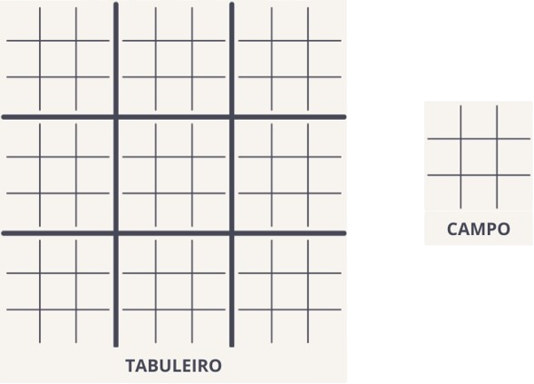
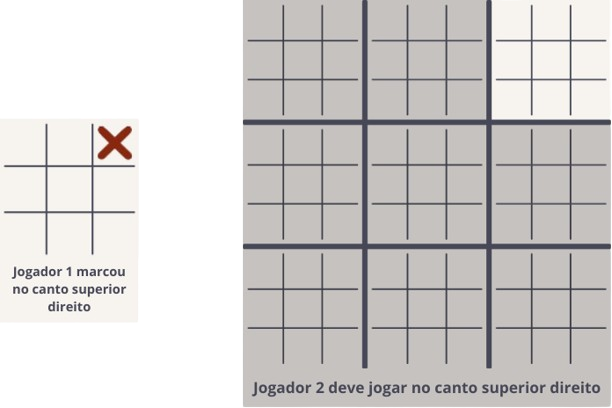
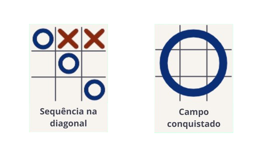
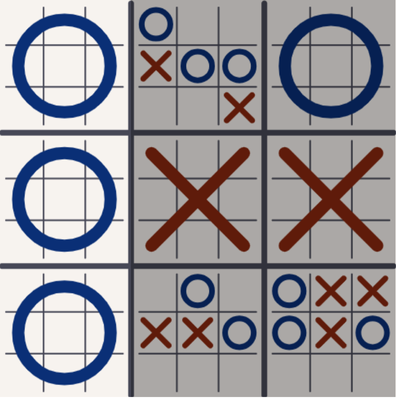

# Tic-Tac-Toe 2

Uma versão atualizada do clássico jogo-da-velha!

## Sumário
- [Visão geral](#visão-geral)
- [Como jogar](#como-jogar)
  - [Tabuleiro](#tabuleiro)
  - [Regra dos turnos](#regra-dos-turnos)
  - [Conquista](#conquista)
  - [Objetivo](#objetivo)
- [Como rodar o jogo](#como-rodar-o-jogo)

## Visão geral

Jogo-da-velha é um jogo extremamente simples. Tanto que pode chegar a ser monótono, principalmente se ambos os jogadores dominarem a [jogada perfeita.](https://pt.wikipedia.org/wiki/Jogo_da_velha#Jogada_perfeita) Felizmente, temos o Tic-tac-toe 2 (também conhecido como Ultimate Tic Tac Toe)! Que traz um tabuleiro bem mais complexo, e regras mais desafiadoras.

## Como jogar

### Tabuleiro

O tabuleiro é composto de uma grade 3x3 grande, semelhante ao jogo-da-velha clássico, chamado "tabuleiro". Cada uma das 9 áreas do tabuleiro contém uma grade 3x3 menor, chamada de "campo". E cada campo contém 9 "células". O jogo começa com o tabuleiro vazio.

 

### Regra dos turnos

O primeiro jogador pode marcar em qualquer lugar (qualquer célula de qualquer campo). 

Porém o próximo jogador poderá marcar apenas no campo que corresponde à célula marcada pelo jogador anterior. Por exemplo, se o jogador 1 marcar uma célula localizada no <b>centro</b> de um <b>campo</b>, o jogador 2 deverá marcar qualquer célula do campo que fica no <b>centro</b> do <b>tabuleiro</b>.

Essa regra vale para todos os turnos do jogo. Exceto quando o jogador 2 seria obrigado a marcar em um campo já conquistado. Nesse caso, o jogador pode jogar em qualquer campo do tabuleiro que não esteja conquistado.

### Conquista

O jogador "conquista" um campo quando marca 3 células posicionadas horizontal, vertical ou diagonalmente dentro de um campo. Assim, o campo será marcado com o seu sinal ("x" ou "o").

### Objetivo

O objetivo do jogo é conquistar 3 campos posicionados horizontal, vertical ou diagonalmente, para ganhar no tabuleiro maior. E, ao mesmo tempo,  impedir que o oponente faça o mesmo.

## Como rodar o jogo

[Jogar Agora com HTML Preview](http://htmlpreview.github.io/?https://github.com/MikaelOliveiraDev/tic-tac-toe-2/blob/main/index.html)
